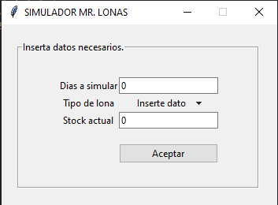
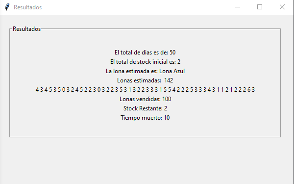
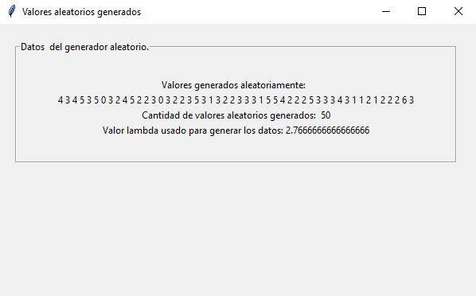

# SimuladorPoisson.
Simulación de variables aleatorias mediante un simulador de Poisson.

# Descripción.
Mr Toldos es una tienda que su funcionalidad es proveer distintos tipos de productos como lonas, toldos entre otros, en donde cada uno de estos ofrece una gran variedad de combinaciones de colores, medidas muy convencionales para cualquier tipo de eventos que solicite el comprador. Este proyecto buscamos poder visualizar mejor nuestro inventario de nuestro día siguiente de nuestra tienda al momento de simular como se venden nuestros toldos. 

# Capturas del programa.

  

  

  

# Referencia a SciPy documentation.

  

